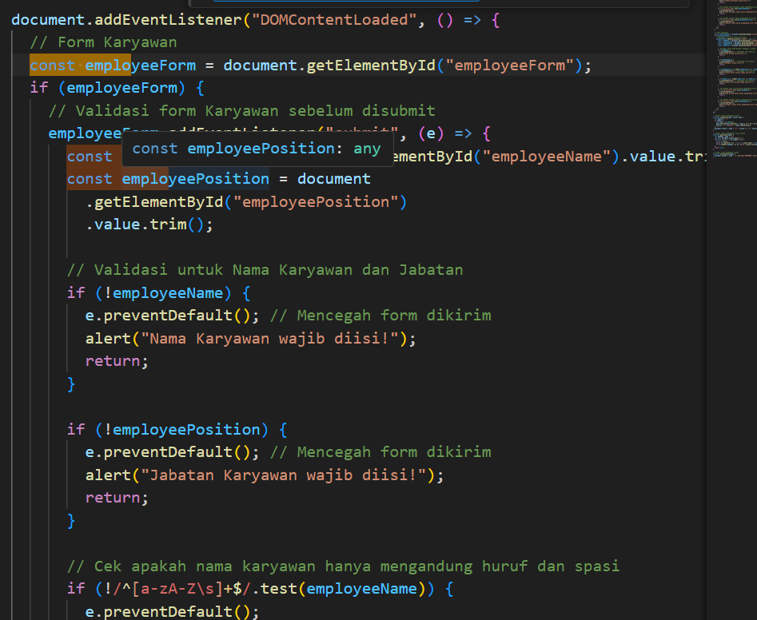
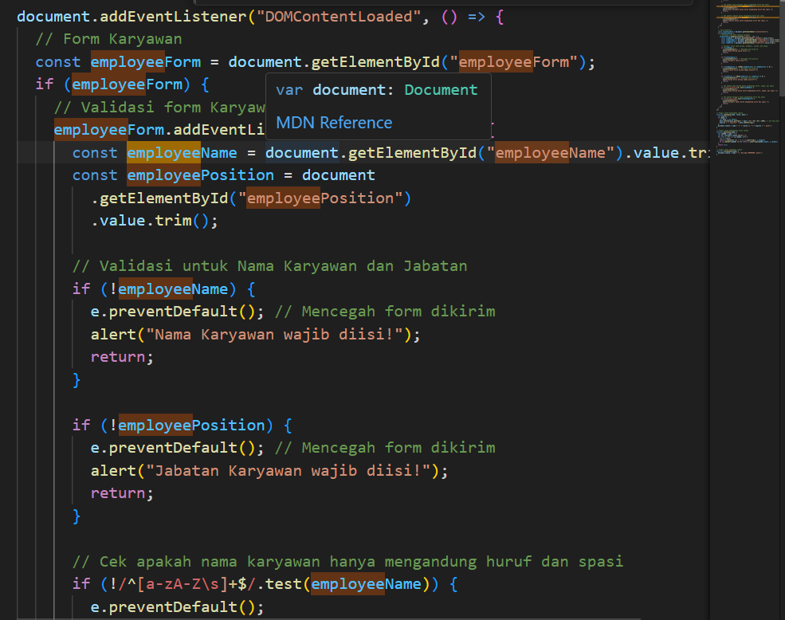
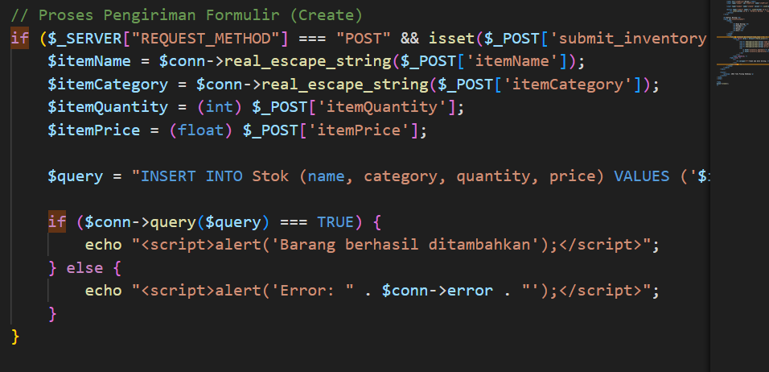
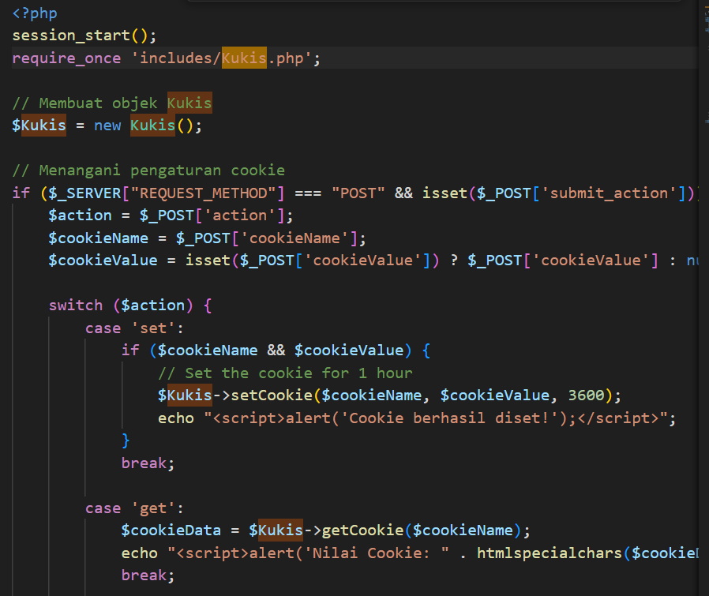
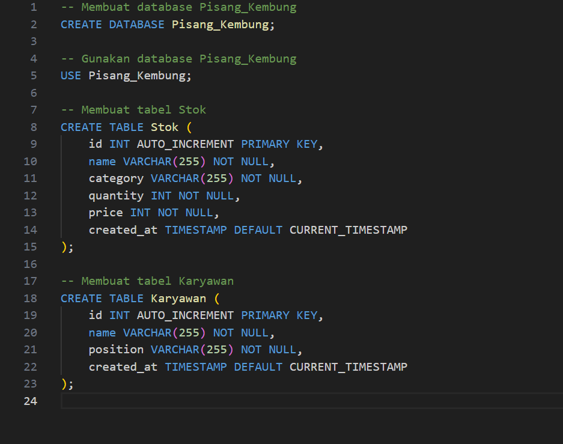
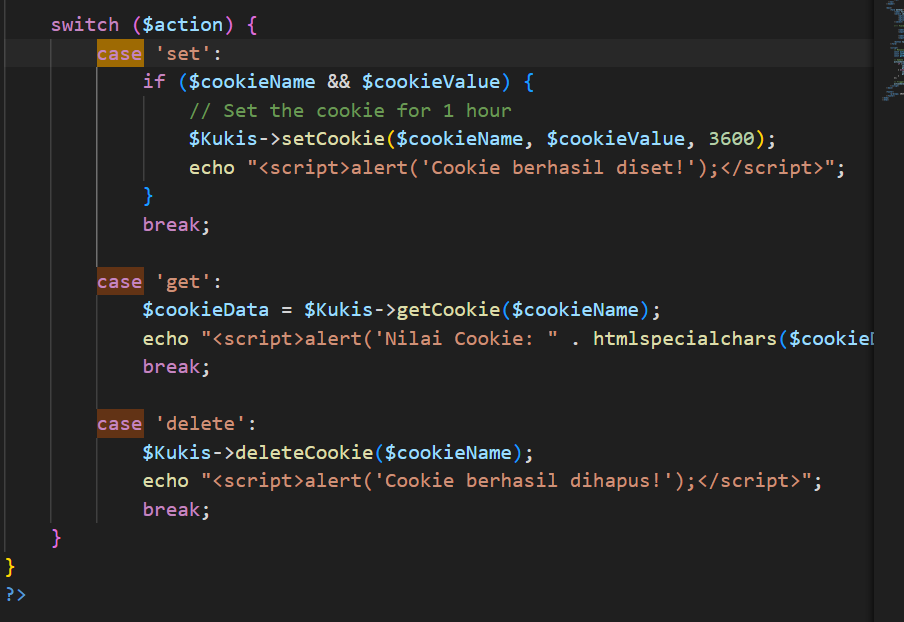

# Project Overview

---

## 1. Manipulasi DOM dengan JavaScript

**Penjelasan:**

Manipulasi DOM dilakukan menggunakan JavaScript untuk membuat 4 elemen input dinamis. Elemen ini dapat digunakan untuk mengumpulkan data dari pengguna secara fleksibel.

---

## 2. Event Handling

**Penjelasan:**

Berbagai event digunakan untuk menangani form. Contohnya adalah form 1.1 yang diatur dengan event JavaScript seperti `onSubmit`, `onChange`, dan `onClick` untuk memvalidasi input dan merespons interaksi pengguna.

---

## 3. Pengelolaan Data dengan PHP

**Penjelasan:**

Data dikirimkan menggunakan metode `POST` atau `GET`. Data dari variabel global PHP diparsing di sisi server dan disimpan dalam basis data. Informasi tambahan seperti jenis browser dan alamat IP pengguna juga direkam.

---

## 4. Objek PHP Berbasis OOP

**Penjelasan:**

Objek PHP dibuat dengan paradigma pemrograman berorientasi objek (OOP). Objek ini digunakan dalam skenario tertentu seperti manajemen stok barang atau autentikasi pengguna.

---

## 5. Database Management

**Penjelasan:**

Pembuatan tabel database dilakukan menggunakan SQL. Konfigurasi koneksi database dilakukan dalam PHP, termasuk manipulasi data seperti menambah, memperbarui, dan menghapus data.

---

## 6. State Management dengan Session

**Penjelasan:**

State management dilakukan menggunakan `session_start` untuk memulai sesi. Informasi pengguna disimpan ke dalam session sehingga dapat digunakan dalam aplikasi selama sesi berlangsung.

---

## 7. Pengelolaan State dengan Cookie

**Penjelasan:**

Cookie digunakan untuk menyimpan data pengguna di browser. Operasi yang didukung termasuk menetapkan, mendapatkan, dan menghapus cookie dengan PHP.

---

## Hosting Website Pisang Kembung

**Link:** [Website Pisang Kembung](#)
