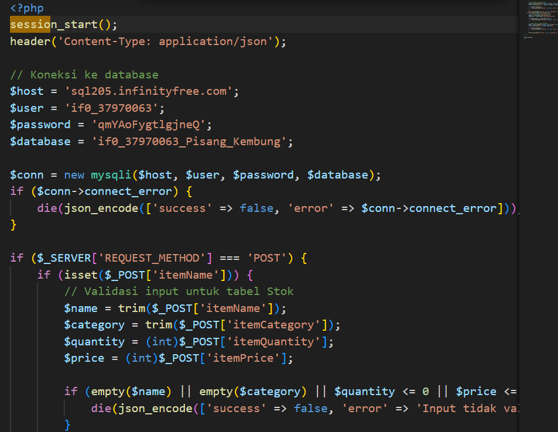

# Project Overview

---

## 1. Manipulasi DOM dengan JavaScript

**Penjelasan:**

Manipulasi DOM dilakukan menggunakan JavaScript untuk membuat 4 elemen input dinamis. Elemen ini dapat digunakan untuk mengumpulkan data dari pengguna secara fleksibel.

---

## 2. Event Handling

**Penjelasan:**

Berbagai event digunakan untuk menangani form. Contohnya adalah form 1.1 yang diatur dengan event JavaScript seperti `onSubmit`, `onChange`, dan `onClick` untuk memvalidasi input dan merespons interaksi pengguna.

---

## 3. Pengelolaan Data dengan PHP

**Penjelasan:**

Data dikirimkan menggunakan metode `POST` atau `GET`. Data dari variabel global PHP diparsing di sisi server dan disimpan dalam basis data. Informasi tambahan seperti jenis browser dan alamat IP pengguna juga direkam.

---

## 4. Objek PHP Berbasis OOP

**Penjelasan:**

Objek PHP dibuat dengan paradigma pemrograman berorientasi objek (OOP). Objek ini digunakan dalam skenario tertentu seperti manajemen stok barang atau autentikasi pengguna.

---

## 5. Database Management

**Penjelasan:**

Pembuatan tabel database dilakukan menggunakan SQL. Konfigurasi koneksi database dilakukan dalam PHP, termasuk manipulasi data seperti menambah, memperbarui, dan menghapus data.

---

## 6. State Management dengan Session

**Penjelasan:**

State management dilakukan menggunakan `session_start` untuk memulai sesi. Informasi pengguna disimpan ke dalam session sehingga dapat digunakan dalam aplikasi selama sesi berlangsung.

---

## 7. Pengelolaan State dengan Cookie

**Penjelasan:**

Cookie digunakan untuk menyimpan data pengguna di browser. Operasi yang didukung termasuk menetapkan, mendapatkan, dan menghapus cookie dengan PHP.

---

## Hosting Website Pisang Kembung

<a href="http://tokopisbung.wuaze.com">PisangKembung</a>

# Panduan Hosting Aplikasi Web dengan InfinityFree

Dokumen ini memberikan langkah-langkah untuk meng-host aplikasi web menggunakan layanan hosting gratis dari InfinityFree.

## Langkah-Langkah Hosting

### 1. Pendaftaran dan Login ke InfinityFree
1. Buka situs [InfinityFree.net](https://www.infinityfree.net).
2. Daftar akun baru atau masuk jika sudah memiliki akun.

### 2. Membuat Akun Hosting
1. Klik tombol **Create Account** di dashboard InfinityFree.
2. Pilih subdomain gratis yang disediakan atau tambahkan domain milik Anda sendiri.

### 3. Mengunggah File Aplikasi
1. Gunakan **File Manager** di dashboard atau FTP client seperti [FileZilla](https://filezilla-project.org/) untuk mengakses server.
   - Masukkan kredensial FTP dari InfinityFree untuk login.
2. Upload file aplikasi ke direktori `htdocs`.

### 4. Pengaturan Database (Opsional)
1. Jika aplikasi memerlukan database, buat database baru melalui menu **MySQL Databases** di cPanel.
2. Perbarui file konfigurasi aplikasi dengan kredensial database:
   - Host: `sqlXXX.infinityfree.com` (detailnya tersedia di cPanel).
   - Username dan Password: Dapat ditemukan di panel InfinityFree.

### 5. Mengakses Aplikasi Web
Setelah proses upload selesai, aplikasi web Anda dapat diakses melalui URL yang terkait dengan akun hosting.

Contoh: `http://your-subdomain.epizy.com`

## Alasan Memilih InfinityFree
InfinityFree dipilih sebagai layanan hosting karena:

- **Gratis**: Menawarkan fitur dasar tanpa biaya.
- **Mendukung PHP dan MySQL**: Memenuhi kebutuhan aplikasi dengan backend.
- **cPanel Gratis**: Mempermudah pengelolaan file dan database.
- **Subdomain Gratis**: Solusi ideal untuk tahap awal pengembangan.

## Tips Keamanan Aplikasi Web
Untuk menjaga keamanan aplikasi web:

### 1. Aktifkan HTTPS
- Gunakan sertifikat SSL gratis yang tersedia di InfinityFree.
- Pastikan komunikasi antara server dan klien terenkripsi.

### 2. Validasi Input Pengguna
- Pastikan input dari pengguna divalidasi di sisi server untuk mencegah serangan seperti SQL Injection dan XSS.

### 3. Atur Izin File dan Direktori
- Konfigurasikan izin file dan direktori agar tidak dapat diakses secara tidak sah.

### 4. Perbarui Secara Berkala
- Lakukan update aplikasi dan dependensi untuk mengurangi risiko keamanan.

## Konfigurasi Server
Pengaturan server yang digunakan meliputi:

- **PHP Versi Terbaru**: Memanfaatkan versi PHP terkini yang disediakan oleh InfinityFree.
- **MySQL Database**: Menyimpan data aplikasi dengan aman menggunakan kredensial yang kuat.
- **File Upload**: File diunggah menggunakan FTP ke direktori `htdocs`.
- **SSL Configuration**: Mengaktifkan SSL gratis untuk melindungi komunikasi.

---

**Catatan:** Panduan ini cocok untuk pengembangan atau tahap awal. Untuk kebutuhan produksi atau lalu lintas tinggi, disarankan beralih ke layanan hosting berbayar yang menawarkan fitur lebih lengkap.

